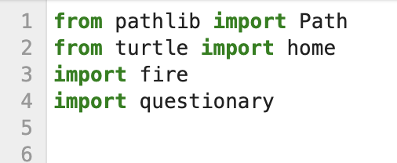
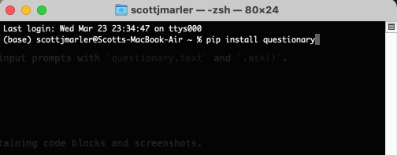
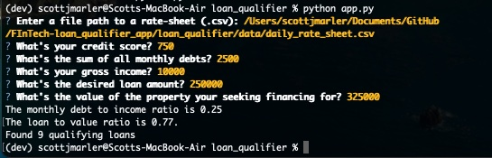
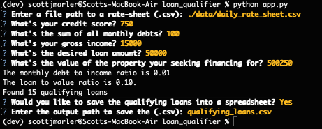

> # Loan Qualifier Application

[](https://www.python.org/)
[](<LINK>)
[](<LINK>)
[](COPYING.txt)


This loan calculator program helps users find banks willing to loan funds based on the users DTI, LTV, and home value. With user data entered,  the program determines what banks have a loan program that suits the users needs. 

---

## Technologies

*The technologies required for the program to run are as follows:*

### Languages:   

### [Python](python.org)

### Libraries:  




---

## Installation Guide

*The program is dependent on the below python dictionaries to run successfully.*

Users should install the dictionaries in terminal(MAC) or bash(Windows) using the following commands:

>   ```pip install fire```


>   ```pip install questionary```



---

## Usage


*The process to run the program is as follows:*

> 1.  open terminal(MAC) or bash(windows) and navigate to the root directory of the loan qualifier application. 
> 2.  once in the command line and navigated to the program directory,  type `python app.py` and click enter. 
> 3.  The program should open and begin asking you a series of questions for user input. 
> 4.  *Enter a file path to a rate-sheet (.csv)*  Provide a path for the location of the `daily_rate_sheet.csv` file.
> 5.  *Whats your credit score?* Provide a credit score.
> 6.  *Whats the sum of all monthly debts?* Provide a sum of your monthly debts.
> 7.  *Whats your gross income?* Provide your gross monthly income.
> 8.  *Whats the desired loan amount?* Enter the amount of funds your seeking for the loan.
> 9.  *Whats the value of the property your seeking financing for?* Enter the value of the property you intend purchase with the loan.
> 10. The program will return user LTV, DTI, and number of banks willing to loan the funds requested. 
> 11. The program will use `.confirm.ask` to see if the user wants to save the data to a csv file. 
> 12. The program will prompt the user for the output path of the data needing to be extracted from the program. 


## Usage Examples





   


---

## Contributors

Scott J. Marler


> ### LinkedIn Profile:     [https://www.linkedin.com/in/scott-marler-212040b6/](https://www.linkedin.com/in/scott-marler-212040b6/)


---

## Licenses

> [GNU General Public License v3.0](COPYING.txt)


