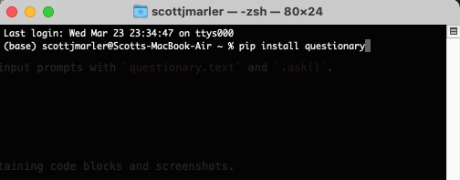
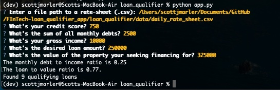

# Project Title

Just after the title, introduce your project by describing attractively what the project is about and what is the main problem that inspires you to create this project or what is the main contribution for the potential user of your project.

---

## Technologies

*The technologies required for the program to run are as follows:*

### Languages:   

### [Python](python.org)

### Libraries:  

### [Fire](https://google.github.io/python-fire/) 

The *Fire* library was used to automatically generate a command line interface for the user. 

### [Questionary](https://pypi.org/project/questionary/) 

The *Questionary* library was used to help build command line user input prompts with `questionary.text` and `.ask()`.  

---

## Installation Guide

*The program is dependent on the below python dictionaries to run successfully.*

Users should install the dictionaries in terminal(MAC) or bash(Windows) using the following commands:

>   ```pip install fire```


>   ```pip install questionary```



---

## Usage


*The process to run the program is as follows:*

> 1.  open terminal(MAC) or bash(windows) and navigate to the directory that holds the program files. 
> 2.  once in the command line and navigated to the program directory,  type `python app.py` and click enter. 
> 3.  The program should open and begin asking you a series of questions for user input. 
> 4.  *Enter a file path to a rate-sheet (.csv)*  Provide a path for the location of the `daily_rate_sheet.csv` file.
> 5.  *Whats your credit score?* Provide a credit score.
> 6.  *Whats the sum of all monthly debts?* Provide a sum of your monthly debts.
> 7.  *Whats your gross income?* Provide your gross monthly income.
> 8.  *Whats the desired loan amount?* Enter the amount of funds your seeking for the loan.
> 9.  *Whats the value of the property your seeking financing for?* Enter the value of the property you intend purchase with the loan.
> 10. The program will return user LTV, DTI, and number of banks willing to loan the funds requested. 



   


---

## Contributors

Scott J. Marler


> ### LinkedIn Profile:     [https://www.linkedin.com/in/scott-marler-212040b6/](https://www.linkedin.com/in/scott-marler-212040b6/)

---

## License

[GNU General Public License v3.0](COPYING.txt)


